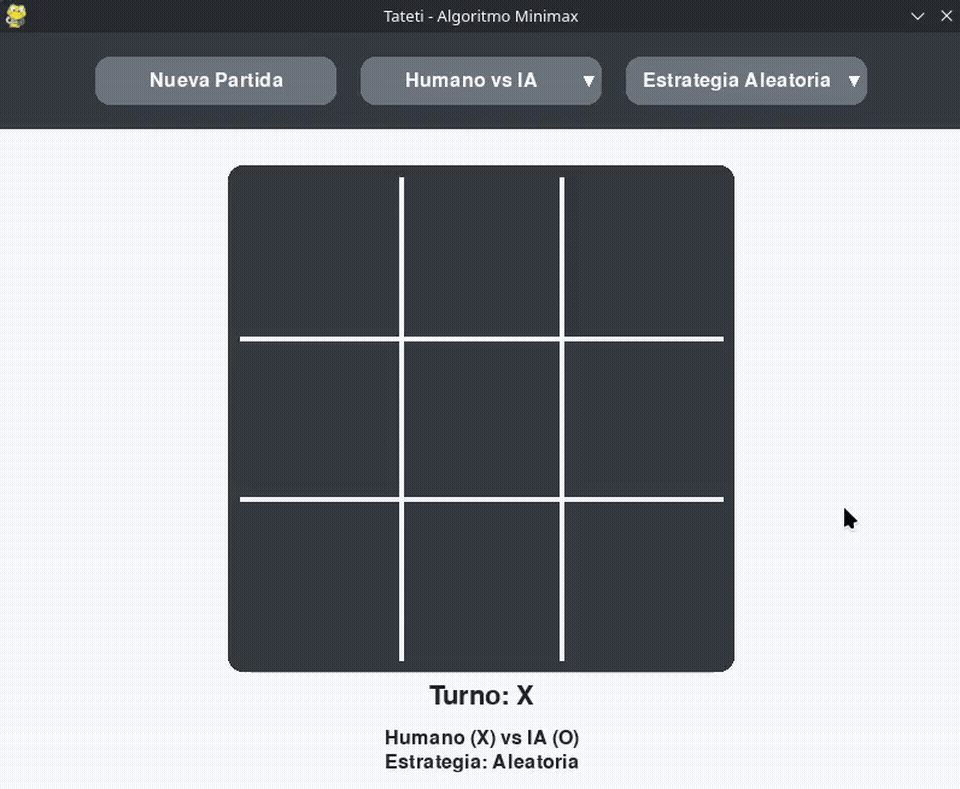

<h1 align="center">Programación III - Inteligencia Artificial y Algoritmos de Búsqueda</h1>

<p align="center">
  
  
  
  
  
</p>

<p align="center">
  <strong>Universidad:</strong> Universidad Nacional de Rosario •
  <strong>Materia:</strong> Programación III •
  <strong>Lenguaje:</strong> Python 3.10+ •
  <strong>Biblioteca gráfica:</strong> Pygame
</p>

---

## 📋 Descripción

Este repositorio reúne los dos trabajos prácticos desarrollados para la materia **Programación III** de la **Universidad Nacional de Rosario**.

Ambos proyectos abordan problemas clásicos de **Inteligencia Artificial**, implementando algoritmos de búsqueda y toma de decisiones con una interfaz gráfica desarrollada en **Pygame**.

Los proyectos fueron realizados de forma grupal y permiten visualizar el funcionamiento interno de los algoritmos mediante animaciones e interacción con el usuario.

---

# 📂 Proyectos

## 1. Pathfinding - Algoritmos de Búsqueda

Implementación y visualización de distintos algoritmos clásicos de búsqueda sobre grafos aplicados al problema de búsqueda de caminos.

<p align="center">
  
</p>

### Algoritmos implementados

* Depth First Search (DFS)
* Breadth First Search (BFS)
* Uniform Cost Search (UCS)
* Greedy Best First Search (GBFS)
* A* Search

### Características

* Visualización paso a paso de la exploración.
* Comparación entre algoritmos.
* Generación de laberintos.
* Interfaz gráfica con Pygame.
* Arquitectura modular.

📄 **Documentación completa:**
👉 [pathfinding/README.md](pathfinding/README.md)

---

## 2. Tateti - Inteligencia Artificial con Minimax

Implementación del juego Tateti (Tres en línea) incorporando una inteligencia artificial basada en el algoritmo **Minimax**.

<p align="center">
  
</p>

### Características

* Implementación del algoritmo Minimax.
* Interfaz gráfica desarrollada con Pygame.
* Tres modos de juego:

  * Humano vs Humano
  * Humano vs IA
  * IA vs IA
* Arquitectura modular.
* Pruebas unitarias.

📄 **Documentación completa:**
👉 [tateti/README.md](tateti/README.md)

---

# 🧠 Conceptos abordados

* Inteligencia Artificial
* Espacio de estados
* Problemas de búsqueda
* Algoritmos de búsqueda informados y no informados
* Teoría de juegos
* Algoritmo Minimax
* Heurísticas
* Representación de grafos
* Estructuras de datos
* Programación orientada a objetos
* Desarrollo de interfaces gráficas con Pygame

---

# 🛠 Tecnologías utilizadas

* Python 3.10+
* Pygame
* Programación Orientada a Objetos
* Git
* GitHub

---

# 📁 Estructura del repositorio

```text
pathfinding-and-tictactoe-ai/
├── assets/
│   ├── gifs/
│   ├── pathfinding/
│   └── tateti/
├── pathfinding/
│   ├── README.md
│   └── ...
├── tateti/
│   ├── README.md
│   └── ...
└── README.md
```

---

# 🚀 Instalación

## 1. Clonar el repositorio

```bash
git clone https://github.com/A6u5/pathfinding-and-tictactoe-ai.git
```

## 2. Acceder al repositorio

```bash
cd pathfinding-and-tictactoe-ai
```

Cada proyecto posee su propio archivo **README.md** con las instrucciones de instalación y ejecución.

* 📄 Pathfinding → `pathfinding/README.md`
* 📄 Tateti → `tateti/README.md`

---

# 👥 Integrantes

* [Agustín Torres](https://github.com/A6u5)
* [Florencia Mezzano](https://github.com/Flormezzano)
* [Sebastián Pérez](https://github.com/PerezSebastian)

---

# 📚 Bibliografía

* Russell, S. & Norvig, P. *Artificial Intelligence: A Modern Approach*.
* Material de la cátedra de Programación III.
