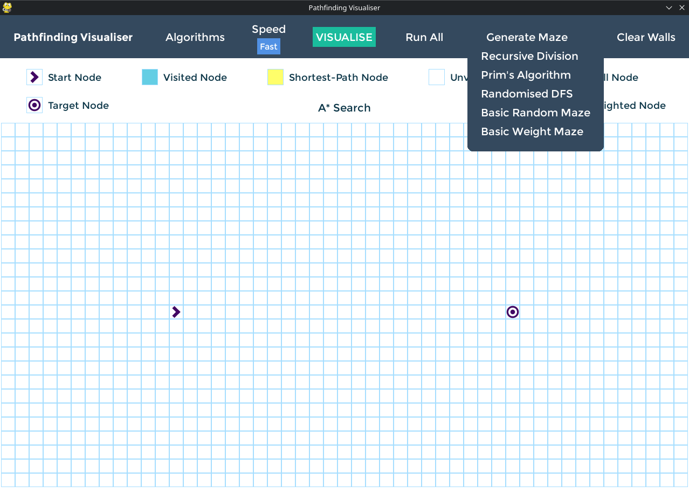
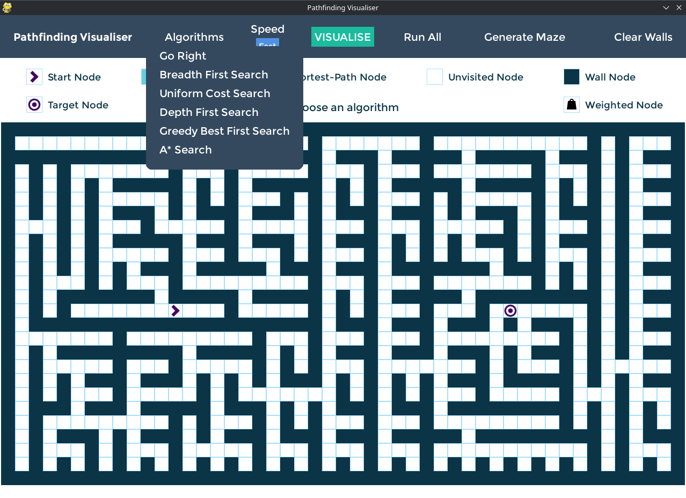
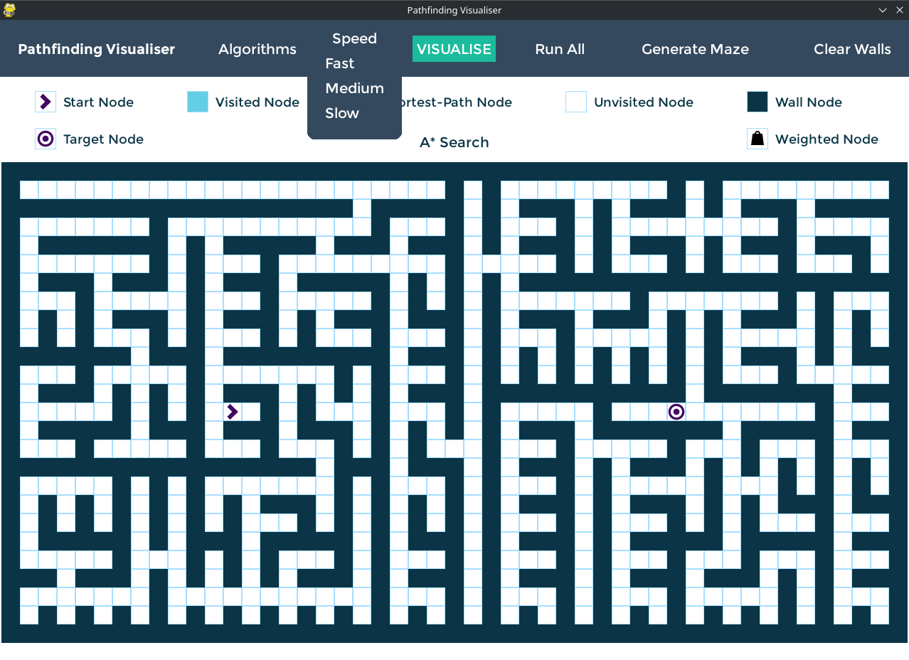
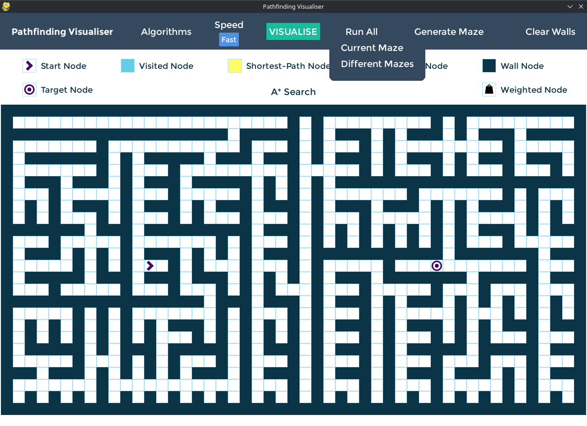
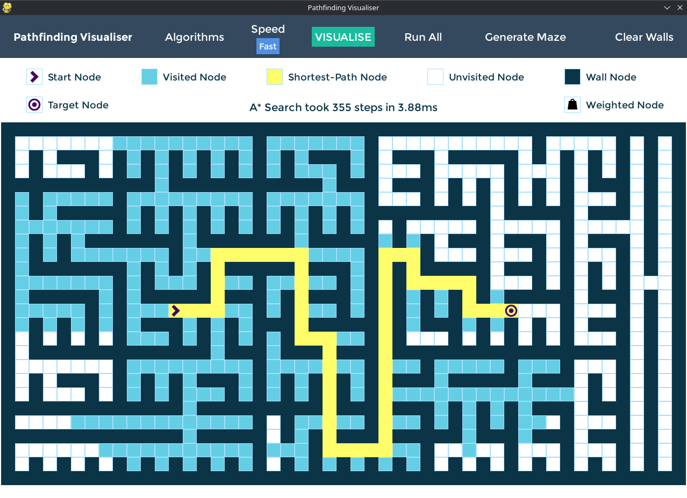
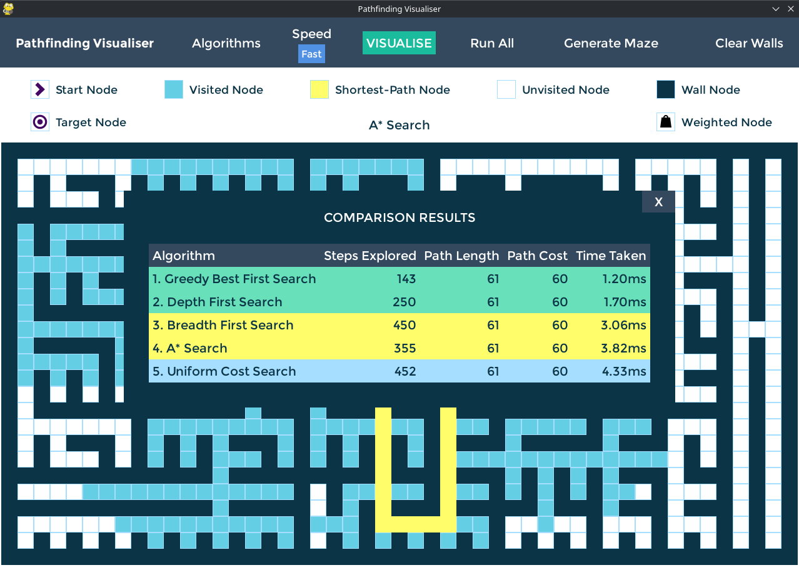

<h1 align="center">Pathfinding - Algoritmos de Búsqueda</h1>

<p align="center">
  
  
  
  
  
</p>

<p align="center">
  <strong>Materia:</strong> Programación III •
  <strong>Lenguaje:</strong> Python 3.10+ •
  <strong>Biblioteca gráfica:</strong> Pygame •
  <strong>Algoritmos:</strong> DFS • BFS • UCS • GBFS • A*
</p>

## 📋 Descripción

Este proyecto implementa y visualiza distintos algoritmos clásicos de búsqueda sobre grafos aplicados al problema de búsqueda de caminos (*Pathfinding*). Fue desarrollado como parte del trabajo práctico de la materia Programación III y permite comparar visualmente el comportamiento de cada algoritmo durante la exploración del espacio de estados y la construcción del camino encontrado.

<p align="center">
  
</p>

## ✨ Características

- Interfaz gráfica desarrollada con Pygame.
- Visualización paso a paso de la exploración.
- Comparación entre distintos algoritmos de búsqueda.
- Arquitectura modular.
- Pruebas unitarias incluidas.

## 🎯 Objetivos

- Implementar algoritmos clásicos de búsqueda.
- Analizar las diferencias entre estrategias informadas y no informadas.
- Comparar rendimiento, completitud y optimalidad.
- Modelar problemas mediante grafos y estados.
- Visualizar el proceso de exploración de cada algoritmo.

## 🤖 Algoritmos implementados
El proyecto implementa cinco algoritmos clásicos de búsqueda utilizados en Inteligencia Artificial para resolver problemas de búsqueda de caminos.

### **Depth First Search (DFS)**

Explora un camino en profundidad antes de retroceder y continuar con otras alternativas.

### **Breadth First Search (BFS)**

Explora todos los nodos de un mismo nivel antes de avanzar al siguiente.

### **Uniform Cost Search (UCS)**

Expande siempre el nodo con menor costo acumulado, garantizando el camino óptimo cuando los costos son positivos.

### **Greedy Best First Search (GBFS)**

Selecciona el nodo que parece más prometedor según una heurística, priorizando rapidez sobre optimalidad.

### **A* Search**

Combina el costo recorrido y una heurística para encontrar caminos óptimos de forma eficiente.

## 📊 Comparativa de algoritmos
| Algoritmo | Completo | Óptimo | Utiliza heurística |
| --------- | :------: | :----: | :----------------: |
| DFS       |     ❌    |    ❌   |          ❌         |
| BFS       |     ✅    |   ✅*   |          ❌         |
| UCS       |     ✅    |    ✅   |          ❌         |
| GBFS      |     ❌    |    ❌   |          ✅         |
| A*        |     ✅    |    ✅   |          ✅         |

Los algoritmos implementados incluyen estrategias de búsqueda tanto informadas como no informadas, permitiendo comparar visualmente su comportamiento, eficiencia y calidad de las soluciones encontradas.

> **Nota:** BFS garantiza un camino óptimo únicamente cuando todas las acciones tienen el mismo costo.

## 📁 Estructura del Proyecto

```text
pathfinding/
├── assets/
│   ├── fonts/
│   └── images/
├── src/
│   ├── pathfinder/
│   │   └── models/
│   ├── search/
│   │   ├── astar.py
│   │   ├── bfs.py
│   │   ├── dfs.py
│   │   ├── gbfs.py
│   │   └── ucs.py
│   ├── animations.py
│   ├── constants.py
│   ├── generate.py
│   ├── main.py
│   ├── maze.py
│   ├── state.py
│   └── widgets.py
├── requirements.txt
├── run.pyw
└── README.md
```

## 🔧 Componentes

### `search/`

Implementa los distintos algoritmos de búsqueda utilizados por la aplicación:

- Depth First Search (DFS)
- Breadth First Search (BFS)
- Uniform Cost Search (UCS)
- Greedy Best First Search (GBFS)
- A* Search

### `pathfinder/models/`

Contiene las estructuras de datos que modelan el problema de búsqueda, incluyendo nodos, fronteras, grillas, soluciones y tipos de búsqueda.

### `maze.py`

Gestiona la generación y representación de los laberintos utilizados durante la búsqueda.

### `animations.py`

Controla las animaciones que muestran la exploración de los nodos y la construcción del camino encontrado.

### `widgets.py`

Implementa los componentes gráficos de la interfaz de usuario desarrollada con Pygame.

### `generate.py`

Permite generar distintos escenarios y configuraciones del entorno de búsqueda.

### `main.py`

Coordina la ejecución de la aplicación y la interacción entre la interfaz gráfica y los algoritmos implementados.

### `run.pyw`

Punto de entrada del proyecto, encargado de iniciar la aplicación.

## 🚀 Instalación

### Requisitos del Sistema

- **Python 3.10+**
- **Windows, macOS o Linux**

### 1. Clonar el repositorio

```bash
git clone https://github.com/A6u5/pathfinding-and-tictactoe-ai.git
```

### 2. Acceder al proyecto

```bash
cd pathfinding-and-tictactoe-ai/pathfinding
```

### 3. Crear un entorno virtual

```bash
python3 -m venv .venv
```

### 4. Activarlo

Linux / macOS

```bash
source .venv/bin/activate
```

Windows (PowerShell)

```powershell
.venv\Scripts\Activate.ps1
```

### 5. Instalar dependencias

```bash
pip install -r requirements.txt
```

### Ejecutar el proyecto

```bash
python3 run.pyw
```
> También es posible ejecutar la aplicación haciendo doble clic sobre `run.pyw` en sistemas Windows que tengan Python correctamente asociado.

## 📸 Capturas

<p align="center">
  
</p>

<p align="center">
  
</p>

<p align="center">
  
</p>

<p align="center">
  
</p>

<p align="center">
  
</p>

<p align="center">
  
</p>


## 👥 Integrantes

- [Agustín Torres](https://github.com/A6u5)
- [Florencia Mezzano](https://github.com/Flormezzano)
- [Sebastián Pérez](https://github.com/PerezSebastian)

## 📚 Bibliografía

- Russell, S. & Norvig. *Artificial Intelligence: A Modern Approach* (Capítulo 2).  
  Disponible en: <http://aima.cs.berkeley.edu/>
