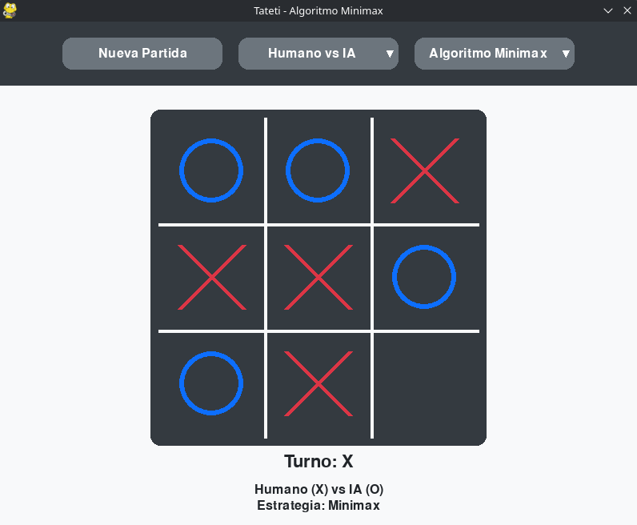
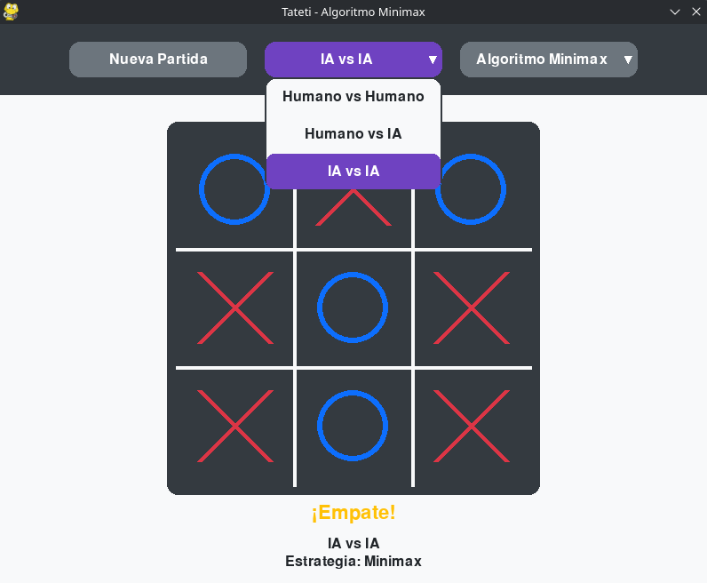
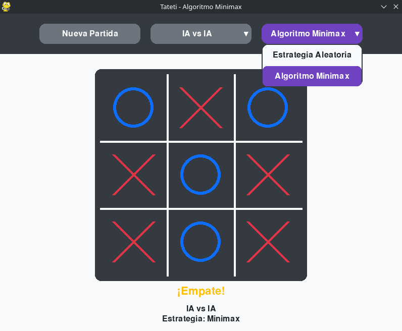

<h1 align="center">Tateti - Inteligencia Artificial con Minimax</h1>

<p align="center">
  
  
  
  
  
</p>

<p align="center">
  <strong>Materia:</strong> Programación III •
  <strong>Lenguaje:</strong> Python 3.10+ •
  <strong>Biblioteca gráfica:</strong> Pygame •
  <strong>Algoritmo:</strong> Minimax
</p>

## 📋 Descripción

Este proyecto consiste en el desarrollo de una versión del juego Tateti (Tres en línea) que incorpora una inteligencia artificial basada en el algoritmo **Minimax**. Fue realizado como parte del trabajo práctico de la materia Programación III y permite enfrentar a un jugador humano contra la computadora, observar partidas entre dos inteligencias artificiales o jugar entre dos personas.

<p align="center">
  
</p>

## ✨ Características

- Interfaz gráfica desarrollada con Pygame.
- Implementación del algoritmo Minimax.
- Tres modos de juego.
- Pruebas unitarias incluidas.
- Arquitectura modular.

## 🎯 Objetivos

- Aplicar conceptos de teoría de juegos.
- Diseñar un agente inteligente basado en Minimax.
- Modelar el problema mediante estados y acciones.
- Integrar la lógica del juego con una interfaz gráfica.
- Validar el funcionamiento mediante pruebas.

## 🤖 Algoritmo Minimax
El algoritmo Minimax explora recursivamente todos los estados posibles del juego y selecciona la acción que maximiza la utilidad del jugador actual suponiendo que el adversario siempre realizará la mejor jugada posible. Dado que el espacio de estados del Tateti es reducido, la IA puede analizar el árbol completo de decisiones y garantizar un juego óptimo.

## 📁 Estructura del Proyecto

```
tateti/
├── tateti.py           # Formulación del juego
├── estrategias.py      # Estrategias de juego
├── gui_pygame.py       # Interfaz gráfica moderna
├── main.py             # Punto de entrada de la aplicación
├── test.py             # Pruebas unitarias
├── requirements.txt    # Dependencias del proyecto
└── README.md           # Este archivo
```

## 🔧 Componentes

### `tateti.py` - Lógica del juego

Implementa la lógica principal del juego, incluyendo la representación del tablero, las reglas, los estados posibles y la detección de condiciones de victoria, empate y jugadas válidas.

### `estrategias.py`

Implementa las distintas estrategias de juego, incluyendo el algoritmo **Minimax**, encargado de calcular la mejor jugada posible explorando recursivamente el árbol de estados.

### `gui_pygame.py`

Contiene la implementación de la interfaz gráfica desarrollada con Pygame, encargada de representar el tablero, gestionar la interacción con el usuario y mostrar el estado de la partida.

### `main.py` - Interfaz gráfica

Aplicación completa con tres modos de juego:
- **Humano vs Humano**: Dos jugadores hacen click en las casillas
- **Humano vs Máquina**: El humano juega contra la IA
- **Máquina vs Máquina**: Observa dos IAs jugando

### `test.py` - Pruebas

Suite de pruebas para verificar tu implementación.

## 🚀 Instalación

### Requisitos del Sistema

- **Python 3.10+** (recomendado)
- **Sistema operativo**: Windows, macOS, o Linux

### 1. Clonar el repositorio

```bash
git clone https://github.com/A6u5/pathfinding-and-tictactoe-ai.git
```

### 2. Acceder al proyecto

```bash
cd pathfinding-and-tictactoe-ai/tateti
```

### 3. Crear un entorno virtual

```bash
python3 -m venv .venv
```

### 4. Activarlo

Linux / macOS

```bash
source .venv/bin/activate
```

Windows (PowerShell)

```powershell
.venv\Scripts\Activate.ps1
```

### 5. Instalar dependencias

```bash
pip install -r requirements.txt
```

### Ejecutar el proyecto

```bash
python3 main.py
```

## 🎮 Modos de juego

- Humano vs Humano
- Humano vs IA
- IA vs IA

## 📸 Capturas
<p align="center">
  
</p>

<p align="center">
  
</p>

<p align="center">
  
</p>

## 👥 Integrantes

- [Agustín Torres](https://github.com/A6u5)
- [Florencia Mezzano](https://github.com/Flormezzano)
- [Sebastián Pérez](https://github.com/PerezSebastian)

## 📚 Bibliografía

- Russell, S. & Norvig, *Artificial Intelligence: A Modern Approach* (Capítulo 5).  
  Disponible en: <http://aima.cs.berkeley.edu/>
